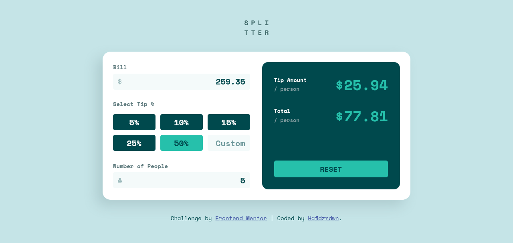

# Frontend Mentor - Tip calculator app solution

This is a solution to the [Tip calculator app challenge on Frontend Mentor](https://www.frontendmentor.io/challenges/tip-calculator-app-ugJNGbJUX). Frontend Mentor challenges help you improve your coding skills by building realistic projects.

## Table of contents

- [Overview](#overview)
  - [The challenge](#the-challenge)
  - [Screenshot](#screenshot)
  - [Links](#links)
- [My process](#my-process)
  - [Built with](#built-with)
  - [What I learned](#what-i-learned)
  - [Continued development](#continued-development)
  - [Useful resources](#useful-resources)
- [Author](#author)
- [Acknowledgments](#acknowledgments)

## Overview

### The challenge

Users should be able to:

- View the optimal layout for the app depending on their device's screen size
- See hover states for all interactive elements on the page
- Calculate the correct tip and total cost of the bill per person

### Screenshot



### Links

- Solution URL: [My Solution](https://github.com/Hafidzrdwn/tip-calculator-app)
- Live Site URL: [Live Preview](https://tip-calculator-everybody.netlify.app/)

## My process

### Built with

- HTML5
- CSS 3
- ES 6
- Flexbox
- Desktop-first workflow

### What I learned

- Responsive web design
- CSS Flexbox
- ES 6 Syntax
- Looping in JS
- Arrow function JS
- Some JS event listener

```js
const proudOfThisFunc = () => {
  console.log("Hello World👾");
};
```

### Continued development

Maybe in the future I will change some designs in this project and add some other interesting features.

### Useful resources

- [CSS Flex](https://www.w3schools.com/css/css3_flexbox.asp) - This really helped me to create responsive and attractive web layouts.
- [JavaScript](https://www.w3schools.com/js/default.asp) - This is an amazing web which helped me finally understand JavaScript. I'd recommend it to anyone still learning this programming language.

## Author

- Website - [Hafidz Ridwan](https://hafidzrdwn.github.io/)
- Frontend Mentor - [@Hafidzrdwn](https://www.frontendmentor.io/profile/Hafidzrdwn)
- Instagram - [@hafidzrdwn](https://www.instagram.com/hafidzrdwn/)

## Acknowledgments

- Web Programming Unpas YT Channel
- Google
- Youtube
- stackoverflow
- w3school.com
- myself
